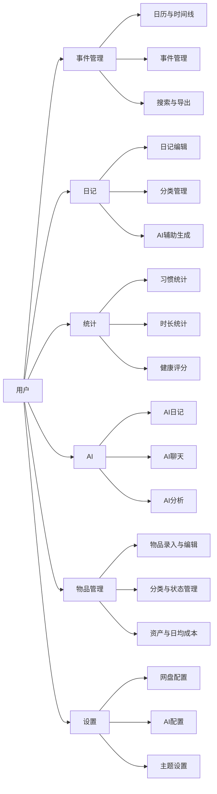

# 个人管理系统

一个基于 React Native + Expo 构建的综合性个人管理应用，集成日记记录、习惯追踪、事件管理、AI辅助分析等功能。

## ✨ 功能特性

### 📅 日记管理
- 支持 Markdown 格式编辑
- 文件夹分类管理
- AI 智能生成日记内容
- 撤销/重做编辑操作
- 搜索与筛选功能

### 📊 习惯追踪
- 多维度习惯统计卡片
- 周/月/年视图切换
- 打卡记录可视化

### 📝 事件管理
- 事件添加、编辑、删除
- 分类管理（睡眠、饮食、运动、工作等）
- 时间线展示
- 智能搜索与筛选

### 🤖 AI 功能
- AI 健康分析报告
- AI 对话聊天
- 批量日记生成
- 阶段总结生成

### 📈 统计分析
- 各维度健康评分（睡眠、饮食、运动、效率、情绪、平衡）
- 评分趋势图表
- 事件时长统计
- 饼图/条形图可视化

### 💾 储物管理
- 物品资产管理
- 日均成本计算
- 分类筛选（未退役/已退役）
- 资产统计报表

### ☁️ 云盘同步
- 支持多种云盘（坚果云、Dropbox、OneDrive、百度云）
- 数据备份与同步
- 连接测试

### 🎨 主题设置
- 多种主题风格（浅色、深色、蓝色、绿色、紫色、奶油色）
- 自定义主色调

## 🛠️ 技术栈

- **框架**: React Native + Expo
- **路由**: Expo Router
- **状态管理**: React Context API
- **数据库**: SQLite (expo-sqlite)
- **图表**: 自定义图表组件
- **图标**: Expo Vector Icons
- **日期处理**: Day.js

## 📁 项目结构

```
app/
├── (tabs)/                 # 底部导航页面
│   ├── index.jsx          # 首页（日历+时间线）
│   ├── diary.jsx          # 日记列表
│   ├── habit-tracking.jsx # 习惯追踪
│   ├── analyse.jsx        # 健康分析
│   ├── statistics.jsx     # 统计报表
│   ├── ai-chat-screen.jsx # AI聊天
│   ├── storage.jsx        # 储物管理
│   └── mine.jsx           # 个人设置
├── diary-edit.jsx         # 日记编辑页
├── ai-analysis.jsx        # AI健康分析页
├── ai-diary-generator.jsx # AI日记生成器
├── search-page.jsx        # 搜索页
├── cloud-drive-settings.jsx # 云盘设置
├── data-generation-page.jsx # 数据导出
└── _layout.jsx            # 根布局

components/
├── common/                # 通用组件
├── chart/                 # 图表组件
├── theme/                 # 主题组件
├── chat/                  # 聊天组件
├── event/                 # 事件组件
├── storage/               # 储物组件
└── statistics/            # 统计组件

core/
├── controller/            # 控制器层
├── service/               # 服务层
├── mapper/                # 数据映射层
├── db/                    # 数据库操作
└── schemas/               # 数据模型

api/                       # API接口
context/                   # Context状态管理
utils/                     # 工具函数
constants/                 # 常量定义
```

## 👤 用户用例图

> 基于当前项目实际页面与模块（`app/`、`components/`、`core/`、`api/`）整理。



## 🚀 快速开始

### 安装依赖

```bash
npm install
```

### 启动开发服务器

```bash
npx expo start
```

### 运行在不同平台

```bash
# Android
npx expo start --android

# iOS
npx expo start --ios

# Web
npx expo start --web
```

## 📱 页面路由

| 路径 | 页面 | 说明 |
|------|------|------|
| `/` | 首页 | 日历+时间线事件 |
| `/diary` | 日记 | 日记列表 |
| `/diary-edit` | 日记编辑 | 新建/编辑日记 |
| `/habit-tracking` | 习惯追踪 | 习惯打卡统计 |
| `/analyse` | 健康分析 | 健康评分与趋势 |
| `/statistics` | 统计报表 | 事件统计图表 |
| `/ai-chat-screen` | AI聊天 | 智能对话 |
| `/storage` | 储物管理 | 资产管理 |
| `/mine` | 个人设置 | 设置中心 |
| `/search-page` | 搜索 | 事件搜索 |
| `/cloud-drive-settings` | 云盘设置 | 云存储配置 |
| `/data-generation-page` | 数据导出 | 数据导出功能 |
| `/ai-analysis` | AI分析 | AI健康分析详情 |
| `/ai-diary-generator` | AI日记生成 | 批量生成日记 |

## 📋 可用脚本

```bash
npm start          # 启动开发服务器
npm run android    # 运行在Android模拟器
npm run ios        # 运行在iOS模拟器
npm run web        # 运行在Web
```
